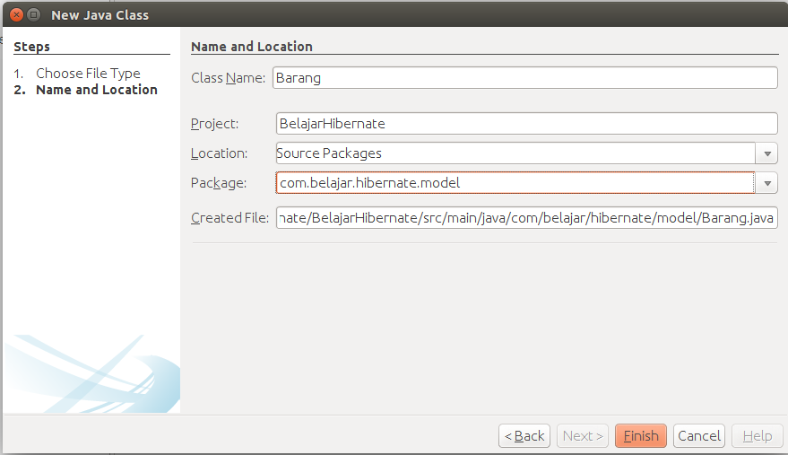
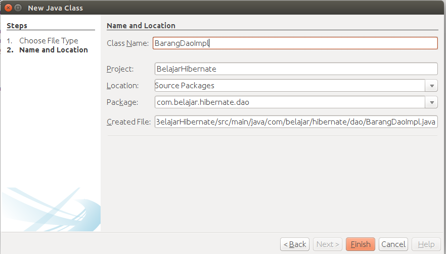
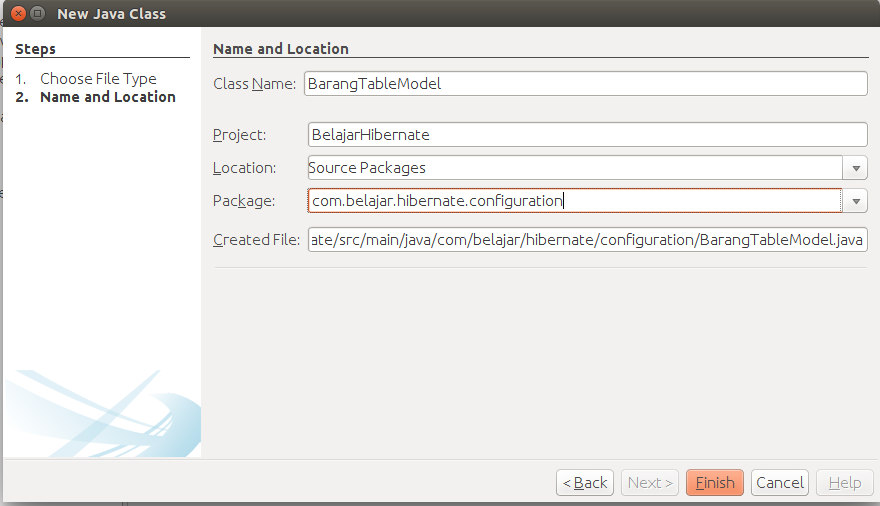

#Implementasi Project Hibernate

Setelah melewati tahap membuat project, langkah selanjutnya adalah kita melakukan coding terhadap project ini sehingga aplikasi akan berjalan sebagaimana mestinya. Pada ebook ini, penulis akan memberi contoh bagaimana cara membuat aplikasi CRUD terhadap data barang. Berikut adalah tahapan untuk membuat aplikasi.

##Membuat Model Barang

Seperti yang telah kita ketahui bahwa agar aplikasi kita buat lebih terstruktur dan lebih bersih maka kita akan menggunakan pattern MVC (model view controller). Silahkan klik kanan pada project anda, lalu pilih new dan pilih java class, kemudian isikan seperti berikut.



maka akan dibuatkan sebuah class dengan nama **Barang**, class ini berfungsi sebagai model dimana class ini akan kita mapping ke tabel yang ada di dalam database. Didalam bahasa pemrograman java kita akan menggunakan aturan **camel case** sehingga setiap nama class akan kita buat dengan menggunakan huruf besar sedangkan jika ada dua kata maka huruf pertama untuk kata kedua juga akan dijadikan huruf besar, contohnya adalaha misalnya **makan siang** maka akan kita ubah menjadi **MakanSiang**.

Silahkan ubah kodingan pada class Barang menjadi seperti berikut :

```java
package com.belajar.hibernate.model;

import java.io.Serializable;
import java.util.Date;
import javax.persistence.Column;
import javax.persistence.Entity;
import javax.persistence.EnumType;
import javax.persistence.Enumerated;
import javax.persistence.GeneratedValue;
import javax.persistence.Id;
import javax.persistence.Table;
import javax.persistence.Temporal;
import javax.persistence.TemporalType;
import org.hibernate.annotations.GenericGenerator;

/**
 * @Author Rizki Mufrizal
 * @Since Dec 6, 2015
 */
@Entity
@Table(name = "tb_barang")
public class Barang implements Serializable {

    @Id
    @GenericGenerator(name = "uuid2", strategy = "uuid2")
    @GeneratedValue(generator = "uuid2")
    @Column(name = "id_barang", length = 150)
    private String idBarang;

    @Column(name = "nama_barang", length = 50)
    private String namaBarang;

    @Column(name = "jenis_barang", length = 10)
    @Enumerated(EnumType.STRING)
    private JenisBarang jenisBarang;

    @Column(name = "tanggal_kadaluarsa")
    @Temporal(TemporalType.DATE)
    private Date tanggalKadaluarsa;

}
```

maka akan muncul error pada baris **JenisBarang** silahkan anda buat sebuah class dengan nama **JenisBarang** di dalam package **com.belajar.hibernate.model** dan kemudian ubah juga menjadi codingan seperti berikut ini.

```java
package com.belajar.hibernate.model;

/**
 * @Author Rizki Mufrizal
 * @Since Dec 6, 2015
 */
public enum JenisBarang {
    gas, padat, cair
}

```

diatas merupakan sebuah class **enum**, mengapa kita menggunakan class ini ? dikarenakan kita ingin setiap user hanya akan melakukan inputan terhadap column **jenis barang** dengan value **gas**, **cair** dan **padat** sehingga tidak ada user yang akan memasukkan inputan ke column **jenis barang** selain dari tiga kata tadi. Kembali lagi ke class **Barang**, untuk melakukan proses **encapsulasi** maka kita akan menggunakan fitur dari netbeans, silahkan pilih menu **refactor** lalu pilih **encapsulate fields**. Kemudian pilih **select all** lalu refactor maka secara otomatis netbeans akan membuatkan getter setter dari setiap variabel yang telah kita deklarasikan tadi. Getter setter ini berfungsi agar variabel yang terdapat di dalam class **Barang** dapat diakses oleh class yang lain, ini merupakan salah satu implementasi dari **encapsulasi**, variabel di dalal  class **Barang** tidak dapat diakses dikarenakan semua variabel ini menggunakan Access Modifier private sehingga hanya bisa diakses oleh class itu sendiri.

Berikut adalah penjelasan sekilas mengenai kodingan diatas.

- **@Entity** berfungsi mendeklarasikan bahwa class ini merupakan sebuah class entity yang akan di mapping oleh hibernate.
- **@Table** berfungsi untuk mendeklarasikan nama tabel.
- **@Id** berfungsi untuk mendeklarasikan bahwa property tersebut merupakan primary key.
- **@GenericGenerator** berfungsi sebagai generator dari UUID, UUID ini adalah sebuah string yang digenerate secara random sehingga sangat cocok untuk dijadikan sebagai primary key.
- **@GeneratedValue** berfungsi untuk memasukkan string UUID ke dalam variabel **idBarang**
- **@Column** berfungsi untuk mendeklarasikan definisi dari sebuah kolom. di dalam **@Column** terdapat **name** yang berfungsi sebagai nama column yang akan dibuat di dalam database, sedangkan **length** berfungsi sebagai panjang dari column tersebut.
- **@Enumerated** berfungsi untuk mendeklarasikan bahwa field tersebut adalah berisi value yang hanya dapat dipilih.
- **@Temporal** berfungsi untuk mendeklarasikan tanggal.

##Membuat Dao Barang

sebelumnya kita telah membuatkan sebuah model, di dalam model hanya berfungsi sebagai mapping ke database, sedangkan ketika kita ingin melakukan query ke database, kita diwajibkan membuat class DAO (data access object) dimana DAO ini hanya akan melakukan query ke database, semua yang berhubungan dengan query ke database akan dilakukan pada bagian DAO. Sehingga jika kita membuat project hibernate maka DAO secara tidak langsung akan menjadi penghubung antara controller dengan model.

Untuk membuat DAO, maka kita akan membuat 2 class, yang pertama adalah class interface dan yang kedua adalah class yang akan melakukan implementasi terhadap class sebelumnya. Silahkan klik kanan pada project lalu pilih new dan pilih java interface lalu isikan seperti berikut.


Kemudian tambahkan kodingan seperti berikut ini.

```java
package com.belajar.hibernate.dao;

import com.belajar.hibernate.model.Barang;
import java.util.List;

/**
 * @Author Rizki Mufrizal
 * @Since Dec 6, 2015
 */
public interface BarangDao {

    public void save(Barang barang);

    public void update(Barang barang);

    public void delete(Barang barang);

    public Barang getBarang(String idBarang);

    public List<Barang> getBarangs();
}

```

pada class ini penulis mendeklarasikan method - method yang akan digunakan oleh aplikasi nantinya. Untuk melakukan implementasinya maka kita buat sebuah class lagi dengan cara klik kanan pada project lalu pilih java class dan isikan seperti berikut.



Setelah selesai, tahap selanjutnya adalah tambahkan codingan pada class **BarangDaoImpl** seperti berikut :

```java
package com.belajar.hibernate.dao;

import com.belajar.hibernate.model.Barang;
import java.util.List;
import org.hibernate.Session;
import org.hibernate.SessionFactory;

/**
 * @Author Rizki Mufrizal
 * @Since Dec 6, 2015
 */
public class BarangDaoImpl implements BarangDao {

    private final SessionFactory sessionFactory;

    public BarangDaoImpl(SessionFactory sessionFactory) {
        this.sessionFactory = sessionFactory;
    }

    @Override
    @SuppressWarnings("ConvertToTryWithResources")
    public void save(Barang barang) {
        Session session = sessionFactory.openSession();
        try {
            session.beginTransaction();
            session.save(barang);
            session.getTransaction().commit();
        } catch (Exception e) {
            session.getTransaction().rollback();
        } finally {
            session.close();
        }
    }

    @Override
    @SuppressWarnings("ConvertToTryWithResources")
    public void update(Barang barang) {
        Session session = sessionFactory.openSession();
        try {
            session.beginTransaction();
            session.update(barang);
            session.getTransaction().commit();
        } catch (Exception e) {
            session.getTransaction().rollback();
        } finally {
            session.close();
        }
    }

    @Override
    @SuppressWarnings("ConvertToTryWithResources")
    public void delete(Barang barang) {
        Session session = sessionFactory.openSession();
        try {
            session.beginTransaction();
            session.delete(barang);
            session.getTransaction().commit();
        } catch (Exception e) {
            session.getTransaction().rollback();
        } finally {
            session.close();
        }
    }

    @Override
    @SuppressWarnings("ConvertToTryWithResources")
    public Barang getBarang(String idBarang) {
        Session session = sessionFactory.openSession();
        try {
            session.beginTransaction();
            Barang barang = session.get(Barang.class, idBarang);
            session.getTransaction().commit();
            return barang;
        } catch (Exception e) {
            session.getTransaction().rollback();
            return null;
        } finally {
            session.close();
        }
    }

    @Override
    @SuppressWarnings("ConvertToTryWithResources")
    public List<Barang> getBarangs() {
        Session session = sessionFactory.openSession();
        try {
            session.beginTransaction();
            List<Barang> barangs = session.createCriteria(Barang.class).list();
            session.getTransaction().commit();
            return barangs;
        } catch (Exception e) {
            session.getTransaction().rollback();
            return null;
        } finally {
            session.close();
        }
    }

}
```

masing - masing method tersebut merupakan implementasi dari class **BarangDao** dimana setiap method tersebut diimplementasi berdasarkan fungsinya. Dikarenakan disini penulis tidak menggunakan spring maka kita diwajibkan menggunakan **transaction** secara manual, penjelasan tentang transaction akan dijelaskan lebih lanjut pada bab spring. Berikut adalah penjelasan mengenai beberapa kodingan diatas :

```java
    private final SessionFactory sessionFactory;
```

merupakan class **interface** dimana class ini akan diinject ke dalam konfigurasi **hibernate**, penjelasan mengenai inject akan dijelaskan pada bab spring.

```java
    public BarangDaoImpl(SessionFactory sessionFactory) {
        this.sessionFactory = sessionFactory;
    }
```

merupakan sebuah class **constructor** dimana untuk melakukan implementasi **dependency injection** kita bisa menggunakan class **constructor**.

```java
    @Override
    @SuppressWarnings("ConvertToTryWithResources")
    public void save(Barang barang) {
        Session session = sessionFactory.openSession();
        try {
            session.beginTransaction();
            session.save(barang);
            session.getTransaction().commit();
        } catch (Exception e) {
            session.getTransaction().rollback();
        } finally {
            session.close();
        }
    }
```

sintak **@Override** merupakan implementasi dari **inheritance** dimana **@Override** itu merupakan overriding atau sebuah method diturunkan dari orang tua ke anak tetapi method tersebut diimplementasikan berbeda dengan orang tuanya. sintak **session** berfungsi sebagai manipulasi data, sebernarnya class **session** ini juga diinject dengan menggunakan class **SessionFactory** jadi bisa dibilang bahwa session membutuhkan depent dari class **SessionFactory**. Sintak **session.beginTransaction();** berfungsi untuk memulai transaction dan tahap selanjutnya adalah dia menyimpan data dengan menggunakan variabel session. Dapat dilihat bahwa dengan menggunakan hibernate maka kita dapat dengan mudah melakukan manipulasi data dan OOP pada java akan terlihat jelas.

##Membuat Hibernate Util Dan Tabel Model

Langkah selanjutnya silahkan buat class baru seperti berikut ini.



setelah selesai kemudian masukkan codingan berikut ini.

```java
package com.belajar.hibernate.configuration;

import com.belajar.hibernate.model.Barang;
import java.util.ArrayList;
import java.util.List;
import javax.swing.table.AbstractTableModel;

/**
 * @Author Rizki Mufrizal
 * @Since Dec 7, 2015
 */
public class BarangTableModel extends AbstractTableModel {

    private List<Barang> barangs = new ArrayList<>();
    private final String HEADER[] = {"ID Barang", "Nama Barang", 
    "Jenis Barang", "Tanggal Kadaluarsa"};

    public BarangTableModel(List<Barang> barangs) {
        this.barangs = barangs;
    }

    @Override
    public int getRowCount() {
        return barangs.size();
    }

    @Override
    public int getColumnCount() {
        return HEADER.length;
    }

    @Override
    public String getColumnName(int columnIndex) {
        return HEADER[columnIndex];
    }

    @Override
    public Object getValueAt(int rowIndex, int columnIndex) {
        Barang barang = barangs.get(rowIndex);

        switch (columnIndex) {
            case 0:
                return barang.getIdBarang();
            case 1:
                return barang.getNamaBarang();
            case 2:
                return barang.getJenisBarang();
            case 3:
                return barang.getTanggalKadaluarsa();
            default:
                return null;
        }
    }

}

```

fungsi dari class diatas adalah untuk memberikan label untuk setiap column yang ada di dalam tabel. Nantinya kita akan membuat sebuah tabel dimana tabel tersebut berisikan data barang. Buatlah sebuah class untuk meload konfigurasi hibernate. Berikut adalah gambar untuk membuat class tersebut.


kemudian isikan dengan codingan berikut.

```java
package com.belajar.hibernate.configuration;

import com.belajar.hibernate.dao.BarangDao;
import com.belajar.hibernate.dao.BarangDaoImpl;
import org.hibernate.SessionFactory;
import org.hibernate.cfg.Configuration;

/**
 * @Author Rizki Mufrizal
 * @Since Dec 7, 2015
 */
public class HibernateUtil {

    private static final SessionFactory SESSION_FACTORY;
    private static final BarangDao BARANG_DAO;

    static {
        try {
            SESSION_FACTORY = new Configuration().configure()
            .buildSessionFactory();
            BARANG_DAO = new BarangDaoImpl(SESSION_FACTORY);
        } catch (Throwable ex) {
            System.err.println("Initial SessionFactory creation failed." + ex);
            throw new ExceptionInInitializerError(ex);
        }
    }

    public static SessionFactory getSessionFactory() {
        return SESSION_FACTORY;
    }

    public static BarangDao getBarangDao() {
        return BARANG_DAO;
    }
}
```

##Membuat View Barang

Langkah selanjutnya adalah kita membuat view terlebih dahulu, mengapa demikian ? dikarenakan controller hanya sebagai penghubung antara view dan model sehingga kita diharuskan membuat view terlebih dahulu. Untuk membuat view silahkan klik kanan pada project anda lalu pilih JFrame Form seperti gambar berikut ini.


kemudian drag drop component pada menu palette, pilih pada bagian swing containers dan swing control karena kita hanya menggunakan komponent swing tanpa menggunakan AWT. Silahkan buat tampilan seperti berikut ini.


Selanjutnya kita akan mengubah name dari setiap component yang telah kita buat tadi. silahkan pilih salah satu component misalnya disini penulis memilih component tabel, klik kanan pada tabel tersebut kemudian pilih properties. Pilih pada tab **code**, pada bagian variable name ubah menjadi **tabel** seperti berikut ini.


kemudian ubah juga untuk setiap component lainnya, berikut adalah daftar yang perlu anda ubah.

| Component   | Name              |
|:------------|:------------------|
|JTextField 1 | idBarang          |
|JTextField 2 | namaBarang        |
|JTextField 3 | jenisBarang       |
|JTextField 4 | tanggalKadaluarsa |
|JButton 1    | simpan            |
|JButton 2    | update            |
|JButton 3    | hapus             |
|JTable 1     | tabel             |

kemudian lakukan refactor terhadap component tersebut seperti halnya class **Barang** di dalam package model.

##Membuat Controller Barang

Setelah selesai kita akan lanjut ke bagian controller. Dibagian controller kita akan mengatur bagaimana cara menghubungkan antara model, dao dan juga view. Silahkan buat sebuah class baru seperti berikut.


Kemudian tambahkan codingan berikut ini pada class **BarangController** seperti berikut.

```java
package com.belajar.hibernate.controller;

import com.belajar.hibernate.configuration.BarangTableModel;
import com.belajar.hibernate.configuration.HibernateUtil;
import com.belajar.hibernate.dao.BarangDao;
import com.belajar.hibernate.model.Barang;
import com.belajar.hibernate.model.JenisBarang;
import com.belajar.hibernate.view.BarangView;
import java.text.ParseException;
import java.text.SimpleDateFormat;
import java.util.List;
import java.util.logging.Level;
import java.util.logging.Logger;
import javax.swing.JOptionPane;

/**
 * @Author Rizki Mufrizal
 * @Since Dec 8, 2015
 */
public class BarangController {

    private final BarangView barangView;
    private BarangTableModel barangTableModel;
    private List<Barang> barangs;

    private final BarangDao barangDao = HibernateUtil.getBarangDao();

    public BarangController(BarangView barangView) {
        this.barangView = barangView;
    }

    public void tampilData() {
        barangs = barangDao.getBarangs();
        barangTableModel = new BarangTableModel(barangs);
        this.barangView.getTabel().setModel(barangTableModel);
    }

    public void show() {
        int index = this.barangView.getTabel().getSelectedRow();
        this.barangView.getIdBarang().setText(String.valueOf(
            this.barangView.getTabel().getValueAt(index, 0)));
        this.barangView.getNamaBarang().setText(String.valueOf(
            this.barangView.getTabel().getValueAt(index, 1)));
        this.barangView.getJenisBarang().setText(String.valueOf(
            this.barangView.getTabel().getValueAt(index, 2)));
        this.barangView.getTanggalKadaluarsa().setText(String.valueOf(
            this.barangView.getTabel().getValueAt(index, 3)));
    }

    public void clear() {
        this.barangView.getIdBarang().setText("");
        this.barangView.getNamaBarang().setText("");
        this.barangView.getJenisBarang().setText("");
        this.barangView.getTanggalKadaluarsa().setText("");
    }

    public void saveBarang() {
        Barang barang = new Barang();
        barang.setNamaBarang(this.barangView.getNamaBarang().getText());
        barang.setJenisBarang(JenisBarang.valueOf(this.barangView
            .getJenisBarang().getText()));

        SimpleDateFormat dateFormat = new SimpleDateFormat("yyyy-MM-dd");

        try {
            barang.setTanggalKadaluarsa(dateFormat.parse(this.barangView
                .getTanggalKadaluarsa().getText()));
        } catch (ParseException ex) {
            Logger.getLogger(BarangController.class.getName()).log(Level
                .SEVERE, null, ex);
        }

        barangDao.save(barang);

        JOptionPane.showMessageDialog(null, "Data Berhasil di Simpan", "info", 
        JOptionPane.INFORMATION_MESSAGE);
        clear();
        tampilData();
    }

    public void updateBarang() {
        Barang barang = new Barang();
        barang.setIdBarang(this.barangView.getIdBarang().getText());
        barang.setNamaBarang(this.barangView.getNamaBarang().getText());
        barang.setJenisBarang(JenisBarang.valueOf(this.barangView
            .getJenisBarang().getText()));

        SimpleDateFormat dateFormat = new SimpleDateFormat("yyyy-MM-dd");

        try {
            barang.setTanggalKadaluarsa(dateFormat.parse(this.barangView
                .getTanggalKadaluarsa().getText()));
        } catch (ParseException ex) {
            Logger.getLogger(BarangController.class.getName()).log(
                Level.SEVERE, null, ex);
        }

        barangDao.update(barang);

        JOptionPane.showMessageDialog(null, "Data Berhasil di Edit", "info",
         JOptionPane.INFORMATION_MESSAGE);
        clear();
        tampilData();
    }

    public void deleteBarang() {

        if (this.barangView.getIdBarang().getText() == null) {
            JOptionPane.showMessageDialog(null, "Barang belum dipilih", "error",
             JOptionPane.ERROR_MESSAGE);
        } else {
            Barang barang = new Barang();
            barang.setIdBarang(this.barangView.getIdBarang().getText());

            int pilih = JOptionPane.showConfirmDialog(null, 
                "Apakah data ingin dihapus ?", "Warning", 
                JOptionPane.YES_NO_OPTION, JOptionPane.WARNING_MESSAGE);

            if (pilih == JOptionPane.YES_OPTION) {
                barangDao.delete(barang);

                JOptionPane.showMessageDialog(null, 
                    "Data Berhasil di Hapus", "info", 
                    JOptionPane.INFORMATION_MESSAGE);
                clear();
                tampilData();
            }
        }
    }
}
```

Kemudian silahkan buka lagi **BarangView** untuk melakukan implementasi coding dari bagian controller ke bagian view. Silahkan ganti dari menu design ke menu source. Tepat dibagian bawah class **BarangView** silahkan deklarasikan sebuah variabel seperti berikut ini.

```java
public class BarangView extends javax.swing.JFrame {

    private final BarangController barangController = new BarangController(this);

    // other resource

}
```

kemudian kita ingin pada saat aplikasi dijalankan, data akan ditampilkan di dalam JTable maka agar dapat ditampilkan kita akan memanggil method show data yang berasal dari class controller. Pemanggilan ini kita deklarasikan di dalam constructor class. Berikut adalah codingan untuk bagian constructor.

```java
public BarangView() {
    initComponents();
    barangController.tampilData();
}
```

Kemudian pindah ke menu design, silahkan klik 2x pada button simpan sehingga akan muncul kodingan, silahkan sesuaikan codingannya seperti berikut.

```java
private void simpanActionPerformed(java.awt.event.ActionEvent evt) {
    barangController.saveBarang();
}
```

Untuk button update juga sama seperti button simpan, berikut adalah codingannya.

```java
private void updateActionPerformed(java.awt.event.ActionEvent evt) {
    barangController.updateBarang();
}
```

untuk button delete seperti berikut.

```java
private void hapusActionPerformed(java.awt.event.ActionEvent evt) {
    barangController.deleteBarang();
} 
```

tahap terakhir adalah ketika tabel diklik maka isian pada row tabel yang dipilih akan ditampilkan di dalam masing - masing text field. Silahkan klik kanan pada tabel lalu pilih events lalu pilih mouse dan pilih mouseclicked. Kemudian masukkan codingan berikut.

```java
private void tabelMouseClicked(java.awt.event.MouseEvent evt) {
    barangController.show();
}   
```

##Membuat Konfigurasi Hibernate

Klik kanan pada project lalu pilih new lalu pilih other, pada bagian categories pilih **hibernate** dan pada bagian **File Types** pilih **Hibernate Configuration Wizard**. Klik next dan biarkan filenya dengan nama **hibernate.cfg** klik next maka akan muncul seperti ini.


Pada tahap ini kita diharuskan membuat database terlebih dahulu, silahkan buka **phpmyadmin** anda lalu buatlah sebuah database dengan nama **belajar**. Setelah selesai, pada gambar diatas silahkan pilih **database connection** lalu pilih **New Database Connection** kemudian pada bagian driver pilih **mysql** klik next lalu isikan seperti berikut ini.


lalu untuk mengetes koneksi silahkan pilih **test connection**, klik next dan finish. Kemudian akan balik lagi ke konfigurasi hibernate dan klik finish agar konfigurasi hibernate digenerate oleh netbeans. Silahkan ganti dari menu design ke menu source kemudian ubah menjadi kodingan seperti berikut ini.

```xml
<?xml version="1.0" encoding="UTF-8"?>
<!DOCTYPE hibernate-configuration PUBLIC "-//Hibernate/Hibernate Configuration 
    DTD 3.0//EN" "http://hibernate.sourceforge.net/hibernate-configuration-3.0.dtd">
<hibernate-configuration>
  <session-factory>
    <property name="hibernate.dialect">
        org.hibernate.dialect.MySQLDialect
    </property>
    <property name="hibernate.connection.driver_class">
        com.mysql.jdbc.Driver
    </property>
    <property name="hibernate.connection.url">
        jdbc:mysql://localhost:3306/belajar?zeroDateTimeBehavior=convertToNull
    </property>
    <property name="hibernate.connection.username">root</property>
    <property name="hibernate.connection.password"></property>
    <property name="hibernate.hbm2ddl.auto">update</property>
    <property name="hibernate.show_sql">true</property>
    <property name="hibernate.format_sql">true</property>
    
    <mapping class="com.belajar.hibernate.model.Barang" />
  </session-factory>
</hibernate-configuration>
```

berikut penjelasan tentang konfigurasi diatas

- **hibernate.dialect** berfungsi untuk mendeklarasikan dialect apa yang akan digunakan, sesuaikan dengan type basis data yang digunakan.
- **hibernate.connection.driver_class** berfungsi untuk mendeklarasikan driver yang akan digunakan.
- **hibernate.connection.url** berfungsi untuk mendeklarasikan url ke sebuah basis data
- **hibernate.hbm2ddl.auto** terdapat beberapa fungsi diantaranya adalah
    * **Create** : Jika table sudah ada maka semua akan di drop dan dibuat ulang.
    * **Update** : jika table belum ada maka akan dibuat, jika tabel sudah ada maka hanya dilakukan update.
- **hibernate.show_sql** berfungsi untuk menampilkan sintak sql yang dilakukan oleh hibernate.
- **hibernate.format_sql** berfungsi untuk melakukan format sql sehingga mudah dibaca.
- **mapping** berfungsi untuk melakukan mapping terhadap class yang dituju, class disini berasal dari package model yang tadinya kita buat.

Kemudian untuk menjalankan aplikasi silahkan klik kanan pada class **BarangView** lalu run file atau dengan shortcut **shift + f6**. Berikut adalah hasilnya.

