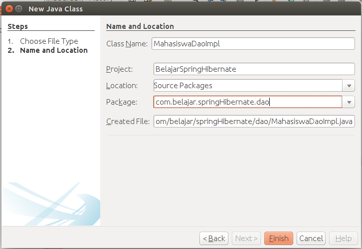

# Implementasi Project Spring Dan Hibernate

Setelah melewati tahap pembuatan project, selanjutnya kita akan mulai melakukan coding dengan hibernate dan spring. Pada bab ini kita akan membuat sebuah aplikasi untuk data mahasiswa.

##Membuat Model Mahasiswa

Sama seperti project sebelumnya kita akan mulai terlebih dahulu untuk membuat class `model`. Silahkan buat sebuah class dengan nama `Mahasiswa` seperti berikut.


Setelah selesai lalu masukkan codingan seperti berikut ini.

```java
package com.belajar.springHibernate.model;

import java.io.Serializable;
import javax.persistence.Column;
import javax.persistence.Entity;
import javax.persistence.Id;
import javax.persistence.Table;

/**
 * @Author Rizki Mufrizal
 * @Since Dec 15, 2015
 */

@Entity
@Table(name = "tb_mahasiswa")
public class Mahasiswa implements Serializable{

    @Id
    @Column(name = "npm", length = 8)
    private String npm;
    
    @Column(name = "nama", length = 50)
    private String nama;
    
    @Column(name = "kelas", length = 10)
    private String kelas;
    
    @Column(name = "alamat", length = 150)
    private String alamat;

    /**
     * @return the npm
     */
    public String getNpm() {
        return npm;
    }

    /**
     * @param npm the npm to set
     */
    public void setNpm(String npm) {
        this.npm = npm;
    }

    /**
     * @return the nama
     */
    public String getNama() {
        return nama;
    }

    /**
     * @param nama the nama to set
     */
    public void setNama(String nama) {
        this.nama = nama;
    }

    /**
     * @return the kelas
     */
    public String getKelas() {
        return kelas;
    }

    /**
     * @param kelas the kelas to set
     */
    public void setKelas(String kelas) {
        this.kelas = kelas;
    }

    /**
     * @return the alamat
     */
    public String getAlamat() {
        return alamat;
    }

    /**
     * @param alamat the alamat to set
     */
    public void setAlamat(String alamat) {
        this.alamat = alamat;
    }
    
}

```

Pada class diatas terdapat 4 variabel dimana variabel ini akan berfungsi sebagai column yang terdapat didalam database. Penjelasan untuk annotation silahkan anda baca kembali pada bab implementasi project hibernate.

##Membuat Dao Mahasiswa

Setelah membuat class `model mahasiswa` langkah selanjutnya adalah membuat class `dao` untuk mahasiswa, class ini berfungsi sebagai class yang akan melakukan akses `query` ke database. Silahkan buat sebuah class interface dengan nama `MahasiswaDao` seperti berikut ini.


kemudian ubah kodingan tersebut seperti berikut ini.

```java
package com.belajar.springHibernate.dao;

import com.belajar.springHibernate.model.Mahasiswa;
import java.util.List;

/**
 * @Author Rizki Mufrizal
 * @Since Dec 15, 2015
 */
public interface MahasiswaDao {

    public void save(Mahasiswa mahasiswa);

    public void update(Mahasiswa mahasiswa);

    public void delete(Mahasiswa mahasiswa);

    public Mahasiswa getMahasiswa(Mahasiswa mahasiswa);

    public List<Mahasiswa> getBarangs();
}
```

Setelah membuat class interface selanjutnya kita ingin melakukan implementasi terhadap class dao tersebut, silahkan buat sebuah class java dengan nama `MahasiswaDaoImpl` seperti berikut ini.



kemudian ubah kodingannya menjadi seperti berikut ini.

```java
package com.belajar.springHibernate.dao;

import com.belajar.springHibernate.model.Mahasiswa;
import java.util.List;
import org.hibernate.SessionFactory;
import org.springframework.beans.factory.annotation.Autowired;
import org.springframework.stereotype.Repository;

/**
 * @Author Rizki Mufrizal
 * @Since Dec 15, 2015
 */

@Repository
public class MahasiswaDaoImpl implements MahasiswaDao{

    @Autowired
    private SessionFactory sessionFactory;

    @Override
    public void save(Mahasiswa mahasiswa) {
        sessionFactory.getCurrentSession().save(mahasiswa);
    }

    @Override
    public void update(Mahasiswa mahasiswa) {
        sessionFactory.getCurrentSession().update(mahasiswa);
    }

    @Override
    public void delete(Mahasiswa mahasiswa) {
        sessionFactory.getCurrentSession().delete(mahasiswa);
    }

    @Override
    public Mahasiswa getMahasiswa(String npm) {
        return sessionFactory.getCurrentSession().get(Mahasiswa.class, npm);
    }

    @Override
    public List<Mahasiswa> getBarangs() {
        return sessionFactory.getCurrentSession().createCriteria(Mahasiswa.class).list();
    }
    
}
```

Dapat dilihat terdapat perbedaan yang sangat signifikan ketika kita hanya menggunakan hibernate dan ketika kita menggunakan hibernate dan spring. Bisa dilihat pada class `MahasiswaDaoImpl` kita menggunakan annotation spring yaitu `@Repository` artinya class ini akan dimanage oleh spring dan juga dengan menggunakan annotation menandakan bahwa class ini merupakan sebuah class `dao`.

Pada baris selanjutnya terdapat annotation `@Autowired`, annotation ini merupakan berasal dari class spring yang berfungsi untuk melakukan injection, pada bab penjelasan konsep dependency injection dijelaskan jika secara manual kita membutuhkan beberapa konfigurasi, jika menggunakan spring kita hanya perlu menggunakan annotation `@Autowired` sehingga spring akan menanage object `SessionFactory`, bisa dilihat bahwa sebelum kita menggunakan spring, kita diharuskan membuat constructor agar object `SessionFactory` bisa diinject. Setelah menggunakan spring maka kita tidak lagi melakukan inject secara manual akan tetapi cukup deklarasikan annotation `@Repository` dan gunakan annotation `@Autowired` untuk object yang akan dilakukan injecti biasanya object tersebut berasal dari class interface contohnya adalah class `SessionFactory` merupakan class interface.

##Membuat Service Mahasiswa